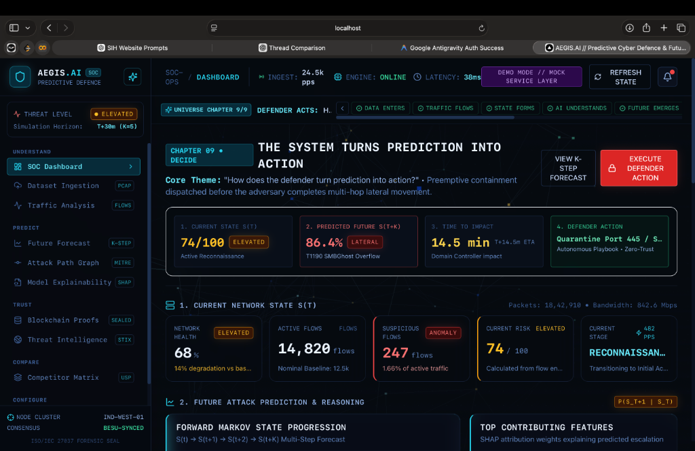

# AEGIS.AI: Predictive Cyber Defence & State-Space Simulation Engine

Autonomous temporal forecasting, explainable neural attribution, and cryptographic evidence anchoring for enterprise security operations.

Repository: [https://github.com/Yash6163/AEGIS.AI.git](https://github.com/Yash6163/AEGIS.AI.git)

---

## Executive Summary

Traditional Security Operations Centers (SOCs) operate reactively: intrusion detection systems alert on indicators of compromise (IoCs) only after an adversary has already breached the perimeter. 

AEGIS.AI fundamentally transforms cyber defence from reactive triage to **continuous forward-state prediction**. By modeling the enterprise network as a temporal graph $G(t)$, AEGIS.AI computes forward Markov state transitions:

$$P(S(t+1) \mid S(t))$$

and simulates attack progression trajectories up to $K$ steps into the future:

$$S(t) \to S(t+1) \to S(t+2) \to \dots \to S(t+K)$$

This capability enables autonomous, preemptive micro-segmentation and firewall rule dispatching 15 to 30 minutes before lateral movement reaches mission-critical assets.

---

## Interface & Output Showcase

### SOC Command & Autonomous Defense Interface
Below is the live operational dashboard displaying real-time network telemetry, forecasted attack escalation, and zero-trust containment playbooks.



---

## System Architecture

The following diagram illustrates the continuous dataflow from raw network telemetry to autonomous containment:

```
[ Raw Network Data ]
       |
       | PCAP / PCAPNG Buffers & CSE-CIC-IDS2018 CSV
       v
[ Dissection Engine ] ------------------------------+
       |                                            |
       | 5-Tuple Sockets, Shannon Entropy, IAT       | Flow Micro-Tensors
       v                                            v
[ Temporal Graph Embedder ] ------------------> [ World Model Engine ]
       |                                            |
       | Graph Snapshot S(t)                        | TGNN + Multi-Head Attention
       v                                            v
[ Forward State Forecast ] <------------------- [ K-Step Markov Rollout ]
       |
       +--------------------+-----------------------+
       |                                            |
       v                                            v
[ Explainability (XAI) ]                    [ Cryptographic Proof ]
  KernelSHAP Attribution                      SHA-256 State Hashing
  Observed Signal Weights                     Merkle Audit Ledger
       |                                            |
       +--------------------+-----------------------+
                            |
                            v
            [ Autonomous Defender Playbook ]
              Preemptive Micro-Segmentation
              STIX 2.1 Threat Syndication
```

---

## The 9 Connected Universe Chapters

AEGIS.AI is organized as an interconnected 9-stage operational pipeline:

| Chapter | Phase | System Objective | Primary Visualization | Key Output Metrics |
| :--- | :--- | :--- | :--- | :--- |
| **01** | **Ingest** | Dissect raw packet captures into temporal tensors | Telemetry Ingestion Flow | Packets, Flows, Protocols |
| **02** | **Analyze** | Map packet conduits and entropy spikes | Interactive Network Flow Topology | 5-Tuple Sockets, IAT Variance |
| **03** | **State** | Construct real-time topological snapshot $S(t)$ | 3D Spatial Network Graph | Active vs Flagged Conduits |
| **04** | **Model** | Train temporal graph embeddings on state shifts | AI World Model Pipeline | $P(S(t+1) \mid S(t))$ Transition |
| **05** | **Forecast** | Simulate $K$-step future attack trajectories | Markov Horizon Timeline | Infiltration % (86.4%), ETA (14.5m) |
| **06** | **Explain** | Attribute neural decisions to observed signals | Horizontal SHAP Bars | SYN (+94%), SMB (+88%) |
| **07** | **Proof** | Seal predictions on tamper-proof ledger | Cryptographic Merkle Chain | SHA-256 Digest, Block Proof |
| **08** | **Intel** | Syndicate indicators across sovereign nodes | Federated STIX 2.1 Graph | TLP Classification, IoC Feeds |
| **09** | **Decide** | Turn predictions into zero-trust containment | Minimalist Command Matrix | Preemptive Port 445 Isolation |

---

## Mathematical Formulation

### 1. State Transition Probability Kernel
The enterprise network state at discrete observation window $t$ is represented by the continuous tensor:

$$S(t) = \langle \mathbf{A}(t), \mathbf{X}(t), \mathbf{F}(t) \rangle$$

Where:
- $\mathbf{A}(t) \in \{0, 1\}^{N \times N}$: Adjacency topology matrix across $N$ hosts.
- $\mathbf{X}(t) \in \mathbb{R}^{N \times D}$: Host attribute matrix (privileges, open ports, vulnerability scores).
- $\mathbf{F}(t) \in \mathbb{R}^{M \times K}$: Flow telemetry tensor (Shannon entropy, packet sizes, inter-arrival times).

The World Model projects $S(t)$ into a latent representation $\mathbf{z}_t$:

$$\mathbf{z}_t = \text{GNN}_{\theta}(\mathbf{A}(t), \mathbf{X}(t), \mathbf{F}(t))$$

The probability distribution over next attack stages is computed via calibrated softmax:

$$P(S(t+1) = s_j \mid S(t)) = \frac{\exp(\mathbf{w}_j^\top \mathbf{z}_t + b_j)}{\sum_{k} \exp(\mathbf{w}_k^\top \mathbf{z}_t + b_k)}$$

### 2. Multi-Step Forward Horizon Rollout
For prediction horizon $K$, states are simulated recursively:

$$S(t+k) \sim P(S(t+k) \mid S(t+k-1)), \quad \forall k \in [1, K]$$

### 3. Feature Attribution (Shapley Value Computation)
To justify autonomous defensive action, feature importance $\phi_i$ is computed via KernelSHAP:

$$\phi_i = \sum_{S \subseteq F \setminus \{i\}} \frac{|S|!(|F| - |S| - 1)!}{|F|!} \left[ f(S \cup \{i\}) - f(S) \right]$$

---

## Detailed Technology Stack

A comprehensive architectural rationale explaining the "What and Why" of every technology choice is documented in:

**[TECH_STACK.md](TECH_STACK.md)**

### Technology Summary Table

| Category | Component | Purpose |
| :--- | :--- | :--- |
| **Core Framework** | Next.js 14 (App Router) | High-performance React framework with server-side generation |
| **Language** | TypeScript 5.4 | Strict type checking and enterprise interface contracts |
| **3D & Spatial Visuals** | Three.js & React Three Fiber | Hardware-accelerated WebGL ambient network universe |
| **CSS Engine** | TailwindCSS 3.4 | Custom HSL cyber tokens, glassmorphism, and responsive layout |
| **Motion Engine** | Framer Motion (motion.dev) | Physics-based micro-interactions and route animations |
| **ML Representation** | TGNN + Dual-LSTM | Temporal Graph Neural Network modeling state transitions |
| **Explainability (XAI)** | KernelSHAP & Attention | Feature attribution scores and plain-language SOC synthesis |
| **Cryptographic Trust** | SHA-256 & Merkle Proofs | ISO/IEC 27037 compliant immutable evidence trails |
| **Threat Intelligence** | STIX 2.1 & TAXII 2.1 | Standardized federated community threat syndication |

---

## Quickstart & Execution Guide

### Prerequisites
Ensure your local environment meets the following baseline requirements:
- **Node.js**: Version `18.17.0` or higher (Node.js `20.x` LTS recommended)
- **npm**: Version `9.x` or higher
- **Browser**: Google Chrome, Mozilla Firefox, or Safari with WebGL 2.0 hardware acceleration enabled
- **Git**: Installed and configured

---

### Step 1: Clone the Repository
```bash
git clone https://github.com/Yash6163/AEGIS.AI.git
cd AEGIS.AI
```

---

### Step 2: Install Dependencies
Install all required dependencies using clean npm resolution:
```bash
npm install
```

---

### Step 3: Run the Development Server
Launch the Next.js local development server:
```bash
npm run dev
```

Open your browser and navigate to:
```
http://localhost:3000
```

---

### Step 4: Validate TypeScript and Build for Production
To verify type safety and generate an optimized production bundle:

```bash
# Run strict type checking without emitting files
npx tsc --noEmit

# Compile production build
npm run build

# Start production server
npm run start
```

The production server will listen on `http://localhost:3000`.

---

## Supported Benchmark Datasets

AEGIS.AI includes seeded mock and real-world benchmark support for:

1. **CSE-CIC-IDS2018 Multi-Vector Infiltration Benchmark**:
   - 80 flow features extracted via CICFlowMeter.
   - Vectors: Brute-force, DoS, DDoS, Web Attacks, Infiltration.
2. **APT29 SMBGhost & Lateral Spread Capture (CVE-2020-0796)**:
   - Deep packet capture featuring SYN scanning, SMB buffer overflow, and domain escalation.
3. **Zeek / Suricata DNS Tunneling & Exfiltration Trace**:
   - High-entropy TXT record queries simulating asynchronous C2 beaconing.

---

## Project Directory Structure

```
AEGIS.AI/
├── docs/
│   └── images/
│       └── dashboard_live.png       # Live SOC dashboard screenshot
├── src/
│   ├── app/                         # Next.js 14 App Router routes
│   │   ├── layout.tsx               # Root application layout
│   │   ├── page.tsx                 # 3D Cyber Universe landing experience
│   │   ├── upload/page.tsx          # Chapter 01: Data Ingestion
│   │   ├── analysis/page.tsx        # Chapter 02: Traffic Extraction & Flow Topology
│   │   ├── attack-path/page.tsx     # Chapter 03: Network State & Spatial Graph
│   │   ├── forecast/page.tsx        # Chapters 04 & 05: World Model & Future Forecast
│   │   ├── explainability/page.tsx  # Chapter 06: Model Explainability (SHAP)
│   │   ├── blockchain/page.tsx      # Chapter 07: Cryptographic Proof & Ledger
│   │   ├── threat-intelligence/page.tsx # Chapter 08: Threat Intelligence Syndication
│   │   ├── dashboard/page.tsx       # Chapter 09: Minimal SOC Command Matrix
│   │   └── competitors/page.tsx     # Strategic competitive positioning matrix
│   ├── components/
│   │   ├── 3d/                      # WebGL scenes and Three.js canvas components
│   │   │   ├── CyberEnvironment.tsx # Shared ambient 3D universe
│   │   │   ├── AICore.tsx           # Neural core visualization
│   │   │   └── NetworkNodes.tsx     # Spatial graph nodes
│   │   ├── layout/                  # Navigation, Sidebar, and AppShell
│   │   └── ui/                      # Glassmorphic cyber design system components
│   ├── services/                    # Data service abstraction layer
│   │   ├── mock/                    # Seeded deterministic benchmark telemetry
│   │   └── index.ts                 # Service registry interface
│   └── types/                       # Strict TypeScript domain interfaces
├── public/                          # Static assets and telemetry buffers
├── TECH_STACK.md                    # In-depth technical architecture audit
├── README.md                        # Primary project documentation
├── package.json                     # Dependency manifest and scripts
├── tailwind.config.ts               # Custom HSL design tokens
└── tsconfig.json                    # Strict TypeScript compiler options
```

---

## Security, Standards & Compliance

- **Forensic Admissibility**: Conforms to ISO/IEC 27037:2012 standards for digital evidence integrity through immutable SHA-256 Merkle tree verification.
- **MITRE ATT&CK Mapping**: All predicted transitions and historical detections map directly to MITRE ATT&CK Enterprise Matrix v14 technique identifiers.
- **Privacy & Sovereign Security**: Zero external telemetry exfiltration. All inference and simulation models operate in an air-gapped or localized deployment mode.

---

## License & Attribution

Developed for the Smart India Hackathon (SIH) Cybersecurity Initiative.
Licensed under the Apache 2.0 License.
